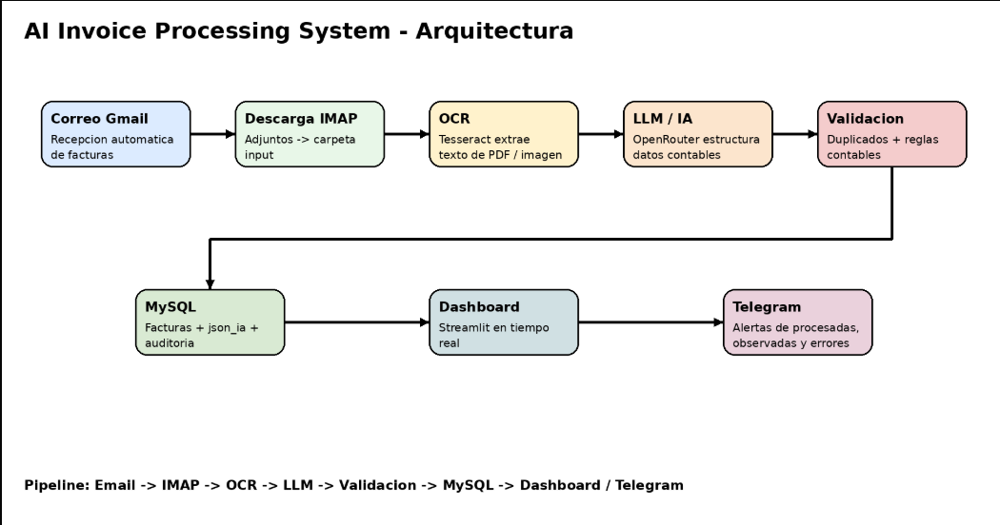
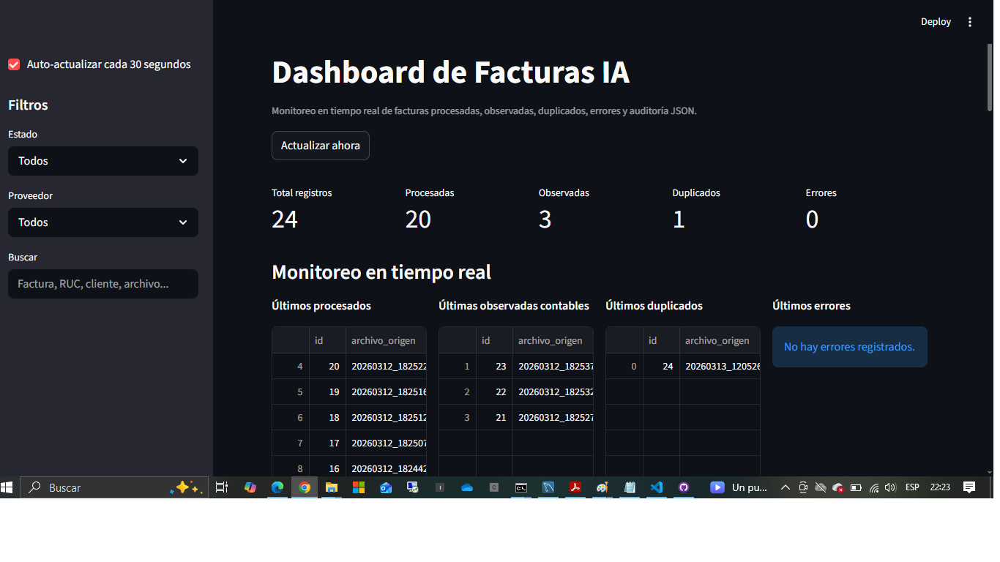

# AI Invoice Processing System

Sistema automático de procesamiento inteligente de facturas utilizando **OCR + LLM + MySQL + Dashboard + Automatización por correo**.

Este proyecto demuestra cómo construir un pipeline de procesamiento de documentos empresariales con IA.

---

# Arquitectura del sistema

Flujo del sistema:

Email → Descarga IMAP → Carpeta input → OCR → LLM → Validación → MySQL → Dashboard / Telegram

---

# Tecnologías utilizadas

- Python
- Tesseract OCR
- OpenRouter LLM API
- MySQL
- Streamlit
- Telegram Bot API
- IMAP Email Automation

---

# Tipos de IA implementados

## Document AI
Extracción automática de datos estructurados desde documentos empresariales.

## OCR (Computer Vision)
Uso de Tesseract para convertir documentos escaneados e imágenes en texto.

## LLM (Large Language Models)
Uso de modelos de lenguaje para interpretar el texto y convertirlo en JSON estructurado.

---

# Funcionalidades principales

- Procesamiento automático de PDF / JPG / JPEG / PNG
- Descarga automática de facturas desde correo
- Extracción automática de:

numero_factura  
fecha_emision  
proveedor  
ruc_proveedor  
subtotal  
igv  
total  
forma_pago  

- Validación contable automática
- Detección de duplicados
- Registro en MySQL
- Dashboard en tiempo real
- Notificaciones por Telegram

---

# Estructura del proyecto

facturas-ai-processor
│
├── docs
│
├── facturas de ejemplo
│
├── .env.example
├── .gitignore
├── README.md
├── requirements.txt
│
├── dashboard_facturas_tiempo_real.py
├── descargar_adjuntos_email_automatico.py
└── procesador_facturas_automatico_validacion_contable.py

---

# Cómo ejecutar

Instalar dependencias

pip install -r requirements.txt

Ejecutar procesador

python procesador_facturas_automatico_validacion_contable.py

Ejecutar dashboard

streamlit run dashboard_facturas_tiempo_real.py

---

# Seguridad

No subir a GitHub:

.env  
logs/  
input/  
procesadas/  
error/  
duplicados/  
observadas/

---
## Arquitectura del sistema

## Dashboard

---

# Autor

Carlos Eugenio Vilcatoma Ocaña  
Consultor TI — Transformación Digital & IA