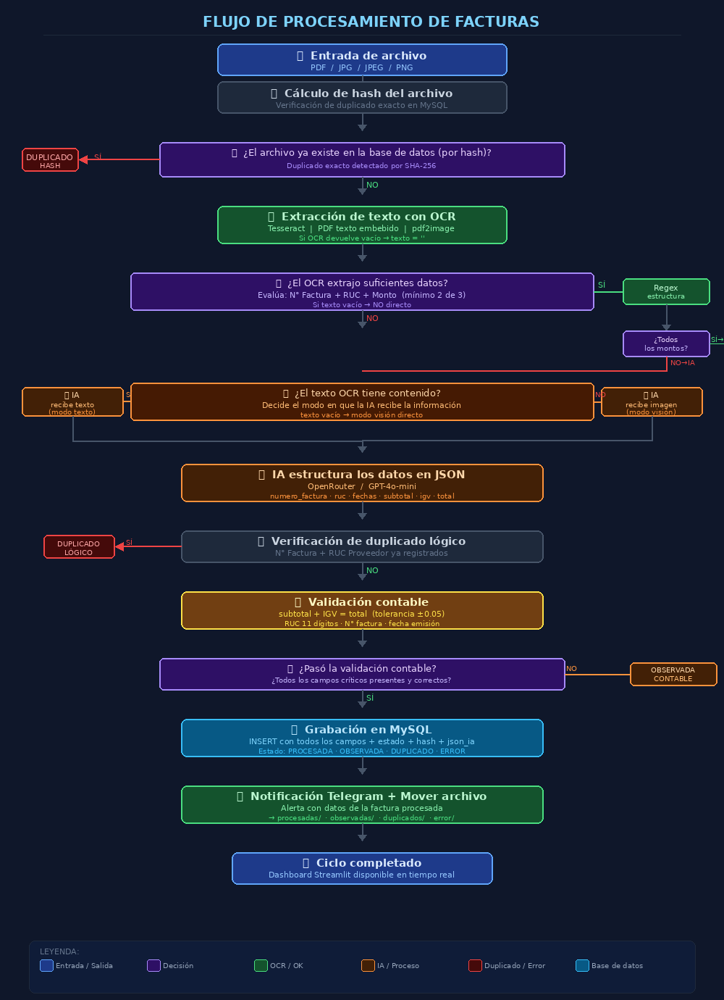
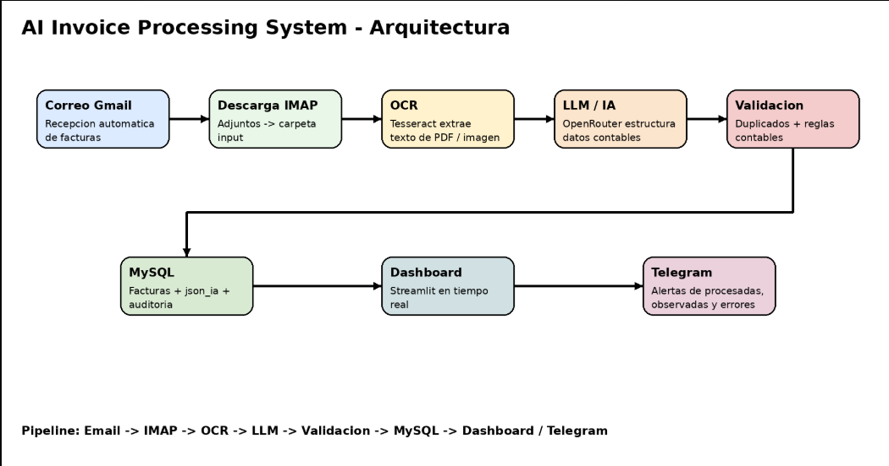
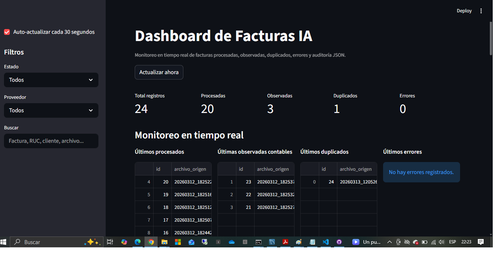

# 🧾 AI Invoice Processing System

Sistema automático de procesamiento inteligente de facturas utilizando **OCR + LLM + MySQL + Dashboard + Automatización por correo**.

Este proyecto implementa un pipeline completo de procesamiento de documentos empresariales con IA, capaz de leer facturas en PDF e imagen, extraer sus datos, validarlos contablemente y grabarlos en una base de datos MySQL.

---


---

## 📋 Tabla de contenidos

- [Arquitectura y flujo](#arquitectura-y-flujo)
- [Tecnologías utilizadas](#tecnologías-utilizadas)
- [Estructura del proyecto](#estructura-del-proyecto)
- [Requisitos previos](#requisitos-previos)
- [Instalación paso a paso](#instalación-paso-a-paso)
- [Configuración del archivo .env](#configuración-del-archivo-env)
- [Creación de carpetas del sistema](#creación-de-carpetas-del-sistema)
- [Cómo ejecutar](#cómo-ejecutar)
- [Lógica de procesamiento OCR → IA](#lógica-de-procesamiento-ocr--ia)
- [Estados de las facturas](#estados-de-las-facturas)
- [Funcionalidades principales](#funcionalidades-principales)
- [Seguridad](#seguridad)
- [Autor](#autor)

---

## Arquitectura y flujo

El sistema implementa un flujo en cascada: primero intenta extraer los datos con OCR (sin costo), y solo escala a la IA cuando el OCR no es suficiente.



### Resumen del flujo

```
Archivo entra (PDF / JPG / PNG)
        ↓
Cálculo de hash → ¿Duplicado exacto? → DUPLICADO_HASH
        ↓ NO
Extracción de texto con OCR (Tesseract / PyMuPDF)
        ↓
¿OCR extrajo N° factura + RUC + Monto?
    ↓ SÍ → ¿Regex puede estructurar todos los montos?
                ↓ SÍ → Graba directo (sin llamar a la IA)
                ↓ NO → Escala a IA
    ↓ NO / texto vacío → Escala a IA
        ↓
¿El texto OCR tiene contenido?
    ↓ SÍ → IA recibe el texto y estructura en JSON
    ↓ NO → IA recibe la imagen directamente (modo visión)
        ↓
¿Duplicado lógico? (mismo N° factura + RUC) → DUPLICADO_LOGICO
        ↓ NO
Validación contable (subtotal + IGV = total, RUC 11 dígitos, etc.)
        ↓
¿Pasó validación? → SÍ: PROCESADA | NO: OBSERVADA_CONTABLE
        ↓
Graba en MySQL + Notificación Telegram + Mueve archivo
        ↓
Dashboard Streamlit en tiempo real
```

### Los 3 escenarios de extracción

| Escenario | Tipo de archivo | OCR | IA |
|---|---|---|---|
| 1 | PDF con texto embebido | Lee texto directo | Estructura en JSON |
| 2 | Imagen clara / buena calidad | Extrae texto con Tesseract | Estructura en JSON |
| 3 | Imagen borrosa / ilegible | No puede leer | Recibe imagen directa (modo visión) |

> **Nota:** En los escenarios 1 y 2 la IA recibe el texto extraído por el OCR. En el escenario 3, cuando el OCR devuelve vacío, la IA recibe la imagen en base64 directamente para interpretarla visualmente.

---

## Tecnologías utilizadas

| Tecnología | Uso |
|---|---|
| Python 3.10+ | Lenguaje principal |
| Tesseract OCR | Extracción de texto de imágenes y PDFs escaneados |
| PyMuPDF (fitz) | Lectura de texto embebido en PDFs |
| pdf2image + Poppler | Conversión de PDF a imagen para OCR |
| OpenRouter / GPT-4o-mini | Estructuración de datos con LLM y visión |
| MySQL | Almacenamiento de facturas procesadas |
| Streamlit | Dashboard de monitoreo en tiempo real |
| Telegram Bot API | Alertas automáticas por mensaje |
| IMAP (imaplib) | Descarga automática de adjuntos desde correo |
| python-dotenv | Gestión de variables de entorno |

---

## Estructura del proyecto

```
facturas-ai-processor-main/
│
├── docs/                          ← Imágenes para el README
│   ├── flujo_procesamiento_facturas.png
│   ├── arquitectura_facturas_ai.png
│   └── dashboard_facturas.png
│
├── facturas de ejemplo/           ← Facturas de prueba
│
├── input/                         ← 📂 Coloca aquí las facturas a procesar
├── procesadas/                    ← ✅ Facturas procesadas correctamente
├── observadas/                    ← ⚠️ Facturas con observaciones contables
├── duplicados/                    ← 🔁 Facturas detectadas como duplicadas
├── error/                         ← ❌ Facturas que generaron error
├── logs/                          ← 📋 Registros del sistema
│
├── .env                           ← Variables de entorno (NO subir a GitHub)
├── .env.example                   ← Plantilla de configuración
├── .gitignore
├── .gitattributes
├── LICENSE
├── README.md
├── requirements.txt
│
├── procesador_facturas_automatico_validacion_contable.py   ← Motor principal
├── dashboard_facturas_tiempo_real.py                       ← Dashboard Streamlit
└── descargar_adjuntos_email_automatico.py                  ← Descarga desde correo
```

> **Importante:** Las carpetas `input/`, `procesadas/`, `observadas/`, `duplicados/`, `error/` y `logs/` son creadas automáticamente al ejecutar el procesador. Sin embargo puedes crearlas manualmente antes si lo prefieres.

---

## Requisitos previos

Antes de instalar el proyecto asegúrate de tener:

### 1. Python 3.10 o superior
Descarga desde: https://www.python.org/downloads/

### 2. Tesseract OCR
Descarga el instalador para Windows desde:
https://github.com/UB-Mannheim/tesseract/wiki

Durante la instalación selecciona el idioma **Spanish (spa)** además del inglés.

Ruta de instalación por defecto:
```
C:\Program Files\Tesseract-OCR\tesseract.exe
```

### 3. Poppler (para pdf2image)
Descarga desde: https://github.com/oschwartz10612/poppler-windows/releases

Extrae y agrega la carpeta `bin/` al PATH del sistema, o coloca la ruta completa en el código.

### 4. MySQL Server 8.0
Descarga desde: https://dev.mysql.com/downloads/installer/

Durante la instalación configura:
- Usuario: `root`
- Puerto: `3306`
- Anota la contraseña que configures

> **Tip:** Si MySQL Workbench no conecta con `localhost`, usa `127.0.0.1` en el campo Hostname. Esto soluciona el problema de resolución IPv4/IPv6 en Windows.

### 5. Cuenta en OpenRouter
Regístrate en https://openrouter.ai y obtén tu API key. El sistema usa el modelo `gpt-4o-mini`.

### 6. Bot de Telegram
Crea un bot con @BotFather y obtén el `TOKEN` y el `CHAT_ID`.

---

## Instalación paso a paso

### Paso 1 — Clonar el repositorio
```bash
git clone https://github.com/cvilcatoma/facturas-ai-processor.git
cd facturas-ai-processor-main
```

### Paso 2 — Instalar dependencias Python
```bash
pip install -r requirements.txt
```

### Paso 3 — Copiar y configurar el archivo .env
```bash
cp .env.example .env
```
Edita `.env` con tus datos (ver sección siguiente).

### Paso 4 — Verificar Tesseract
Abre una terminal y ejecuta:
```bash
tesseract --version
```
Debes ver la versión instalada. Si no responde, verifica que la ruta esté en el PATH o ajústala directamente en el archivo `procesador_facturas_automatico_validacion_contable.py`:
```python
TESSERACT_CMD = r"C:\Program Files\Tesseract-OCR\tesseract.exe"
TESSDATA_DIR  = r"C:\Program Files\Tesseract-OCR\tessdata"
```

### Paso 5 — Verificar MySQL
Asegúrate de que el servicio MySQL esté corriendo:
```cmd
net start MySQL80
```

---

## Configuración del archivo .env

Copia `.env.example` como `.env` y completa todos los valores:

```env
# OpenRouter (LLM)
OPENROUTER_API_KEY=sk-or-xxxxxxxxxxxxxxxxxxxxxxxxxx

# Telegram
TELEGRAM_TOKEN=123456789:ABCDefgh...
TELEGRAM_CHAT_ID=987654321

# MySQL — usar 127.0.0.1 en lugar de localhost para evitar
# problemas de resolución IPv4/IPv6 en Windows
MYSQL_HOST=127.0.0.1
MYSQL_USER=root
MYSQL_PASSWORD=tu_contraseña
MYSQL_DATABASE=demo_facturas

# Intervalo de revisión de la carpeta input (segundos)
PROCESS_INTERVAL_SECONDS=10

# Correo (solo para descargar_adjuntos_email_automatico.py)
EMAIL_IMAP_HOST=imap.gmail.com
EMAIL_IMAP_PORT=993
EMAIL_USER=tucorreo@gmail.com
EMAIL_PASS=tu_app_password
EMAIL_FOLDER=INBOX
EMAIL_CHECK_INTERVAL_SECONDS=30
```

---

## Creación de carpetas del sistema

El procesador crea las carpetas automáticamente al arrancar. Si prefieres crearlas manualmente:

```
facturas-ai-processor-main/
├── input/        ← Coloca aquí las facturas PDF/JPG/PNG para procesar
├── procesadas/   ← El sistema mueve aquí las facturas OK
├── observadas/   ← Facturas con errores contables (revisión manual)
├── duplicados/   ← Facturas repetidas detectadas por hash o N°+RUC
├── error/        ← Archivos que generaron error en el procesamiento
└── logs/         ← Logs del sistema
```

**En Windows (PowerShell):**
```powershell
mkdir input, procesadas, observadas, duplicados, error, logs
```

**En Linux/Mac:**
```bash
mkdir -p input procesadas observadas duplicados error logs
```

---

## Cómo ejecutar

### Ejecutar el procesador principal
```bash
python procesador_facturas_automatico_validacion_contable.py
```

El sistema arranca en modo automático, revisa la carpeta `input/` cada 10 segundos (configurable) y procesa cualquier archivo nuevo.

Para probar: copia una factura PDF o imagen a la carpeta `input/` y observa el log en la terminal.

### Ejecutar el dashboard
```bash
streamlit run dashboard_facturas_tiempo_real.py
```

Abre automáticamente en: http://localhost:8501

### Ejecutar la descarga automática de correo
```bash
python descargar_adjuntos_email_automatico.py
```

Revisa el correo configurado en `.env` cada 30 segundos y descarga adjuntos PDF/JPG/PNG a la carpeta `input/`.

---

## Lógica de procesamiento OCR → IA

Esta es la mejora principal implementada en la versión actual. El sistema utiliza un **flujo en cascada** para minimizar el uso de la API de IA:

### ¿Por qué cascada?

Llamar a la IA tiene un costo por token. Si el OCR puede extraer y estructurar los datos correctamente, no es necesario gastar la API. La cascada prioriza el método más económico primero.

### Decisiones del flujo

**1. Evaluación del texto OCR**

El sistema analiza el texto extraído buscando:
- Número de factura (formato peruano: `F001-000123`)
- RUC del proveedor (11 dígitos)
- Montos con decimales (`S/ 1,250.00`)

Si encuentra al menos 2 de 3 → intenta estructurar con expresiones regulares.

**2. Estructuración con regex (sin IA)**

Si el regex logra extraer `subtotal + IGV + total` completos → graba directo sin llamar a la IA.

**3. Escalado a IA**

Escala a la IA en cualquiera de estos casos:
- El OCR encontró los campos pero el regex no pudo armar los montos
- El texto OCR está vacío (imagen muy borrosa o ilegible)
- El RUC o número de factura no se pudieron identificar

**4. Modo visión (imagen directa)**

Si el texto OCR está completamente vacío, en lugar de enviar texto vacío a la IA, el sistema convierte la imagen a base64 y la envía directamente al modelo de visión (`gpt-4o-mini`). Esto permite procesar facturas fotografiadas con baja calidad.

### Ejemplo de log del sistema

```
[INFO] Aplicando OCR a imagen...
[INFO] OCR evaluación -> Nº factura: True | RUC: True | Monto: True | Campos: 3/3
[INFO] OCR suficiente. Se intentará extraer datos sin IA.
[INFO] OCR: campos financieros incompletos (subtotal='' | igv='' | total='').
[INFO] Escalando a IA para garantizar datos completos...
[INFO] Llamando a IA para extraer datos...
[INFO] Enviando factura a IA...
[INFO] Datos extraídos por IA OK
[INFO] Validación contable: PROCESADA
[INFO] Guardado en MySQL con ID #5
```

---

## Estados de las facturas

| Estado | Descripción |
|---|---|
| `PROCESADA` | Factura válida, todos los campos completos y correctos |
| `OBSERVADA_CONTABLE` | Datos extraídos pero con inconsistencias (montos, RUC inválido, fechas vacías) |
| `DUPLICADO_HASH` | Archivo exactamente igual ya procesado anteriormente |
| `DUPLICADO_LOGICO` | Mismo número de factura + RUC ya registrados con otro archivo |
| `ERROR` | El procesamiento falló completamente |

---

## Funcionalidades principales

- ✅ Procesamiento automático de PDF / JPG / JPEG / PNG
- ✅ Flujo cascada OCR → IA (ahorro de costos de API)
- ✅ Modo visión: envío de imagen directa a la IA cuando OCR falla
- ✅ Descarga automática de facturas desde correo por IMAP
- ✅ Extracción de campos: número, fechas, proveedor, RUC, cliente, subtotal, IGV, total, forma de pago
- ✅ Validación contable automática (subtotal + IGV = total ±0.05)
- ✅ Validación de RUC (11 dígitos numéricos)
- ✅ Detección de duplicados por hash SHA-256 y por lógica (N° + RUC)
- ✅ Registro completo en MySQL con JSON de auditoría
- ✅ Dashboard Streamlit en tiempo real con filtros, métricas y exportación CSV
- ✅ Notificaciones automáticas por Telegram

---

## Seguridad

Los siguientes archivos y carpetas **no deben subirse a GitHub**. Ya están incluidos en `.gitignore`:

```
.env
logs/
input/
procesadas/
error/
duplicados/
observadas/
```

---

## Arquitectura del sistema



## Dashboard



---

## Autor

**Carlos Eugenio Vilcatoma Ocaña**  
Consultor TI — Transformación Digital & IA  
GitHub: [cvilcatoma](https://github.com/cvilcatoma)
